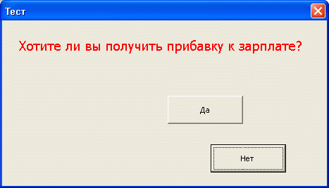
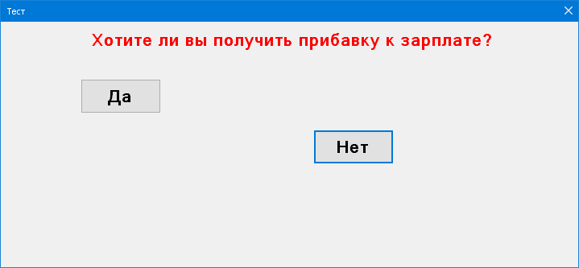

# Тема: Події миші

Створіть додаток за поданим зразком

При наведенні миші на кнопку «Да» кнопка змінює своє місце розташування в межах видимої частини вікна. Користувач не повинен мати змогу натиснути на її. При зміні розмірів вікна кнопки повинні бути в межах вікна. При натисканні на кнопку «Нет», вивести повідомлення «Дякую за співпрацю».

# Результат

