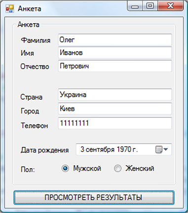

# Тема: Елементи: Label, Button, Edit

Завдання "Анкета". Завдання користувача ввести свої дані в форму.

При натисканні на кнопку дані з форми та дата заповнення анкети записуються до файлу та відображаються у блокноті (У файлі мають зберігатись всі анкети). Зовнішній вигляд програми:

# Результат

