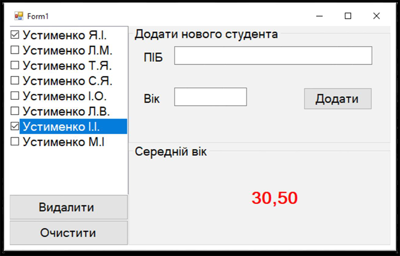
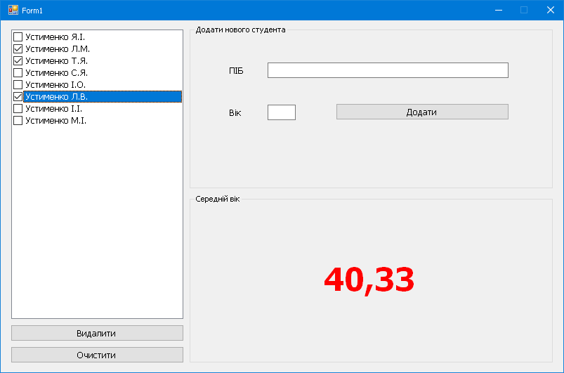

# Тема: LIST

Створити програму за зразком:

Для програми розробити клас Студент з полями ПІБ та Вік.
При натисканні на кнопку додати створюється новий студент з полями з відповідних компонентів, який зберігається у список.
У компоненті CheckedListbox відображаються всі прізвища доданих студентів.
При виборі студентів автоматично підраховується середній вік вибраних.
При натисканні на кнопку ВИДАЛИТИ – зі списку видаляють позначенні студенти.
Кнопка ОЧИСТИТИ – очищує весь список студентів.

# Результат

