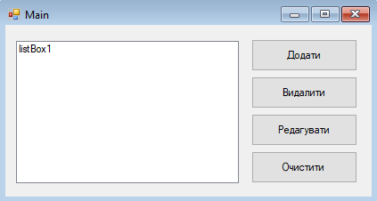
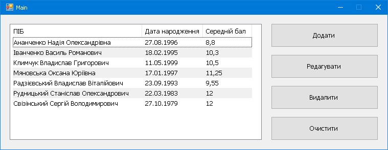

# Тема: Створення додаткових форм.

Створити програму за зразком:

Список повинен містити перелік студентів. Кожен студент містить такі поля: ПІБ, дата народження, середній бал.

При натисканні на кнопку Додати відкривається вікно для введення інформації про нового студента.

При натисканні на кнопку Редагувати відкривається вікно із заповненими полями для редагування.

Всі зміни в списку студентів повинні зберігатись у файл. При завантаженні програма повинна завантажити список студентів.

Проявіть творчість.

# Результат

<!--stackedit_data:
eyJoaXN0b3J5IjpbLTMxODQ1MjIyOV19
-->