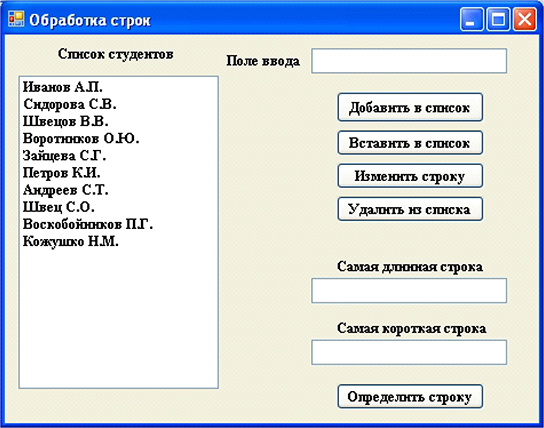
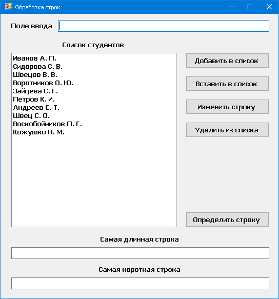

# Тема: ListBox

Разработать программу «Обработка строк», которая должна выполнять  следующие задачи:

- по щелчку на кнопке «Добавить в список» записывать в «Список  студентов» строку из «Поля ввода», содержащую фамилию и инициалы  студента. 20 фамилий можно записать с помощью «Редактора коллекции  строк»;
- по щелчку на кнопке «Вставить в список» вставлять перед выделенной  строкой в «Списке студентов» строку из «Поля ввода»;
- по щелчку на кнопке «Изменить строку» изменять содержимое  выделенной строки в «Списке студентов» на содержимое из «Поля ввода»;
- по щелчку на кнопке «У далить из списка» удалять строку из «Списка  студентов»;
- по щелчку на кнопке «Определить строку» определять самую  длинную и короткую строку и содержание этих строк вывести в  соответствующие поля.

При разработке интерфейса приложения использовать компоненты  Label, Button, TextBox, Panel и ListBox (один из вариантов интерфейса  представлен на рисунке).

# Результат

