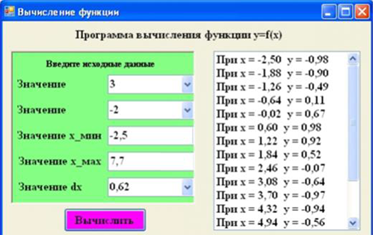
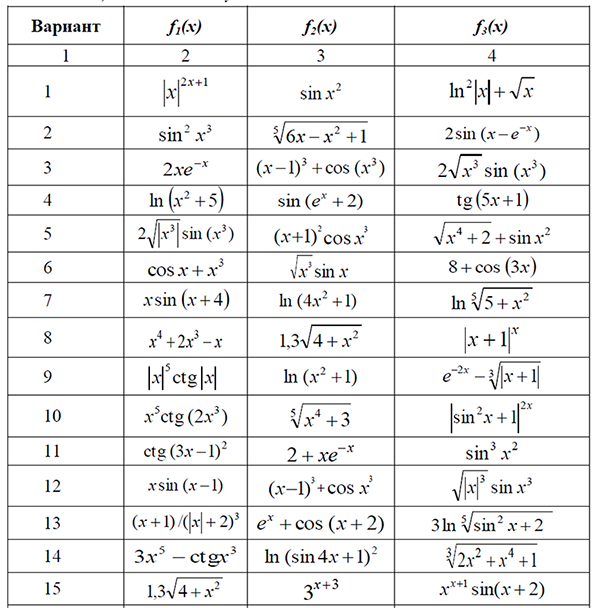
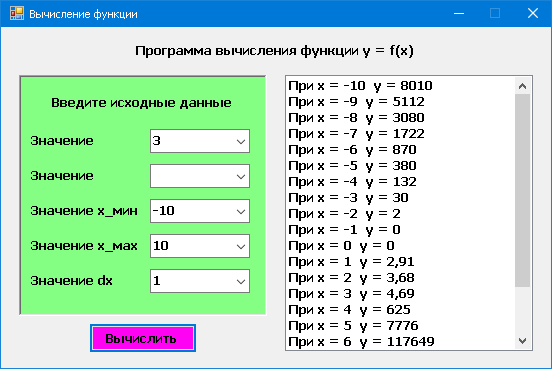

# Тема: ListBox

Разработать программу вычисления значений функции

 = \begin{cases}
   f_1(x), &\text{если } x \le 0 \\
   f_2(x), &\text{если } 0 < x \le a \\
   f_3(x), &\text{если } x > a
\end{cases}
$$

в диапазоне изменения аргумента х от хн до хк с шагом dx.
В форме предусмотреть ввод значения параметра а, хн, хк, dx.
Ввод исходных данных осуществляется с клавиатуры или путем выбора данных из списка.
Результат решения оформить в виде списка. Если результат решения отсутствует (например, из некорректных исходных данных), то в списке решений должно выдаваться соответствующее сообщение.
При разработке интерфейса приложения использовать компоненты Label, ListBox, Button, Panel и ComboBox (один из вариантов интерфейса представлен на рисунке.

# Результат

