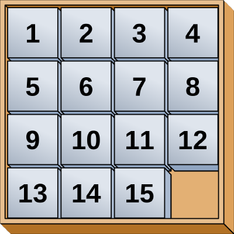
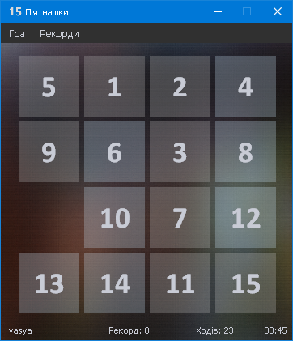

# П'ятнашки

Розробити гру «П’ятнашки» — популярна головоломка, придумана у 1878 році Ноєм Чепменом. Складається з 15 однакових квадратних пластинок з нанесеними числами від 1 до 15. Пластинки поміщаються в квадратну коробку, довжина сторони якої в чотири рази більша довжини сторони пластинок, відповідно в коробці залишається незаповненим одне квадратне поле. Мета гри — переміщаючи пластинки по коробці добитися впорядковування їх по номерах (як зображено на рисунку), бажано зробивши якомога менше переміщень.

Гра повинна мати меню. В рядку стану вивести інформацію про гравця, його найкращий результат (мінімальна кількість переміщень), поточну кількість переміщень, час гри. Зберігати рекорди користувачів. Зберігати гру, а потім мати змогу продовжити.

Врахуйте, що не кожне поле може бути складено.

# Результат

