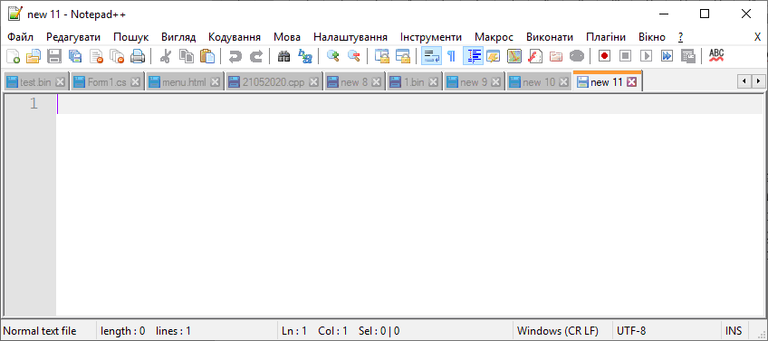

# Тема: Меню. Панель інструментів. Рядок стану

Розробити програму БЛОКНОТ. Добавити меню, панель з кнопками, рядок стану. Кнопки мають виконувати стандартні функції. В рядок стану потрібно добавити: позицію курсора в документі, в рядку, поточний рядок, кількість рядків. Добавити додаткову форму для виведення статистики по тексту: кількість символів, кількість слів, слова, які повторюються більше двох раз (у порядку спадання їх повторень).

Зробіть пошук та заміну по документі.

Для зручності додайте Панель вкладок TabControl.

Для прикладу можна брати Notepad++

# Результат

