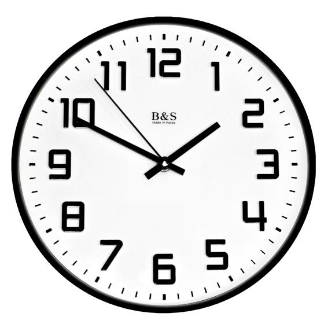
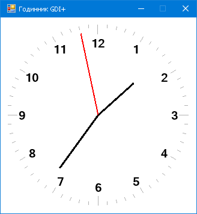

# Тема: GDI+, РУХ

Засобами GDI+ намалювати годинник за поданим зразком, який відображає поточний час.

Средствами GDI+ нарисовать часы по данному образцу, которые отображают текущее время.

# Результат

